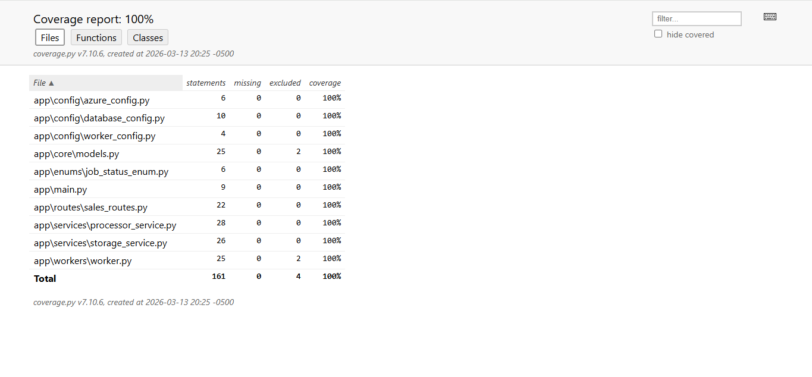
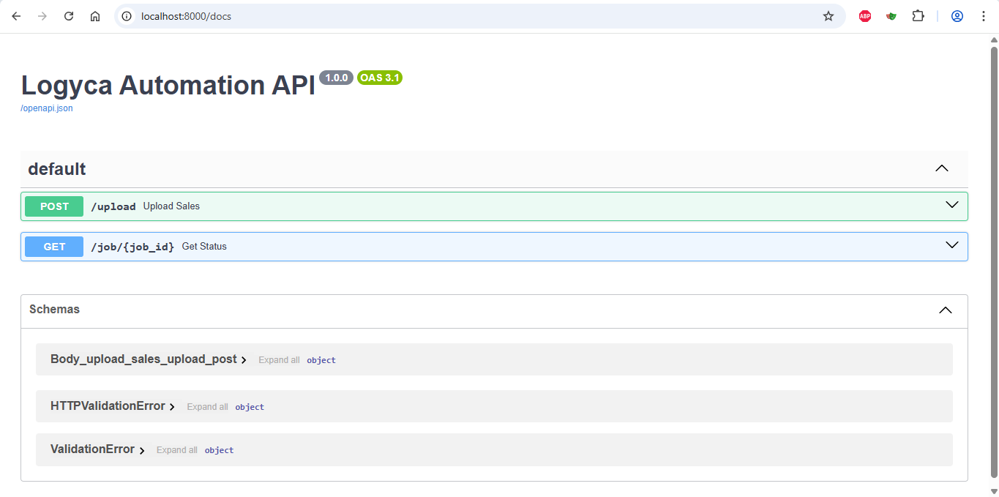

# **Prueba Técnica: Automatización de Procesamiento de Ventas - LOGYCA**

Este proyecto implementa un sistema escalable y asíncrono para la carga masiva de datos de ventas, procesamiento en la nube (Azure) y automatización de reportes diarios.

## **Arquitectura del Sistema**
El sistema se basa en una arquitectura de capas orientada a microservicios:

- **FastAPI (API Gateway)**: Recibe archivos CSV y gestiona el estado de los trabajos.
- **Azure Blob Storage**: Almacenamiento persistente de archivos masivos.
- **Azure Queue Storage**: Orquestador de mensajes para el procesamiento desacoplado.
- **Worker Asíncrono**: Procesa los datos en segundo plano utilizando Pandas y SQLAlchemy 2.0.
- **PostgreSQL**: Base de datos relacional para almacenamiento de ventas y resúmenes.

## **Decisiones Técnicas y Escalabilidad**

### **Procesamiento de Millones de Registros**
Para cumplir con el requisito de no saturar la memoria RAM ni la base de datos, se implementaron las siguientes estrategias:

- **Lectura por Chunks**: El Worker utiliza `pandas.read_csv(chunksize=N)`. Esto garantiza un consumo de memoria O(1) constante, permitiendo procesar archivos de gigabytes sin desbordar el servidor.
- **Inserción Masiva (Bulk Insert)**: Se utiliza el método `to_sql` con `method='multi'` y `engine.begin()`. Esto agrupa múltiples filas en una sola sentencia INSERT, reduciendo drásticamente el overhead de red y transacciones en PostgreSQL.

### **Desacoplamiento (Worker Pattern)**
La API no procesa el archivo. Solo lo sube a Azure y notifica a una cola. Esto permite que la API responda en milisegundos y que el Worker pueda escalar horizontalmente **(ej. ejecutar múltiples instancias del worker si el volumen de archivos aumenta)**.

### **Stack Tecnológico Moderno**

- **SQLAlchemy 2.0**: Uso de la versión más reciente para un manejo de transacciones más robusto y tipado estricto.
- **Pandas 2.2**: Optimización en la manipulación de tipos de datos y compatibilidad con el motor de base de datos.

## **Estrategia de Pruebas**
Se implementó una suite de pruebas unitarias con Pytest logrando una alta cobertura del código:

- **Mocks de Azure**: Se simularon los servicios de Blob y Queue para permitir pruebas en entornos locales sin credenciales de nube.
- **Validación de Lógica**: Se verificó que el cálculo `total = quantity * price` sea preciso.
- **Manejo de Errores**: Pruebas específicas para asegurar que el sistema cambie el estado a `FAILED` ante archivos corruptos.

Para ejecutar las pruebas, usar el comando `python -m pytest .`, se puede visualizar la cobertura en la carpeta `htmlcov` en la raiz del proyecto, y abrir en el navegador el archivo `index.html`



## **Instalación y Configuración**

### **Clonar el repositorio**:

````
git clone https://github.com/Yeisson8A/prueba-logyca.git
cd prueba-logyca
````

### **Configurar variables de entorno**:
Crea un archivo `.env` basado en el `.env.example` con tus credenciales de Azure y PostgreSQL:

- **AZURE_STORAGE_CONNECTION_STRING**: Corresponde a la cadena de conexión del servicio de Blobstorage en Azure **(Access Keys)**
- **AZURE_BLOB_CONTAINER_NAME**: Corresponde al nombre del contenedor dentro del blobstorage, el cual servirá para cargar los archivos CSV. Este puede tener como nombre **por ejemplo: sales-uploads**
- **AZURE_QUEUE_NAME**: Corresponde al nombre de la cola dentro del blobstorage, el cual servirá para dejar los jobs pendientes por procesamiento para el worker, y cargar los respectivos datos del CSV en la base de datos. Este puede tener como nombre **por ejemplo: processing-jobs**
- **DATABASE_URL**: Corresponde a la cadena de conexión de la base de datos PostgreSQL, donde se almacenarán los jobs y su correspondiente estado, los datos de ventas y el resumen diario de ventas
- **CHUNK_SIZE**: Corresponde al tamaño de los fragmentos o número de filas a procesar por el worker en los archivos CSV, a fin de no saturar la memoria. Este puede tener como valor **por ejemplo: 50000**

### **Instalar dependencias**:

`pip install -r requirements.txt`

### **Ejecutar la API**:

`python -m uvicorn app.main:app --reload`



### **Datos de prueba**:
Se anexa archivo CSV con datos utilizados para las pruebas de carga, el cual se encuentra en la carpeta `data` en la raiz del proyecto, y tiene como nombre `test_sales.csv`

### **Ejecutar el Worker**:

`python -m app.workers.worker`

## **Escalabilidad y Concurrencia**

Aunque el Worker actual procesa los mensajes de forma secuencial para garantizar la estabilidad de la memoria RAM, el sistema está diseñado para escalar de las siguientes formas:

- **Escalamiento Horizontal:** Se pueden desplegar múltiples instancias del Worker en paralelo. Gracias al `visibility_timeout` de Azure Queue Storage, cada instancia procesará mensajes distintos sin duplicidad, permitiendo procesar N archivos simultáneamente.
- **Control de Recursos:** Al mantener cada Worker como un proceso independiente, evitamos problemas de contención por el GIL de Python y facilitamos el monitoreo de consumo de recursos por contenedor.

## **Sistema de Trazabilidad (Logging)**

El sistema implementa un esquema de logging robusto y estructurado, esencial para el monitoreo de procesos asíncronos y la depuración en entornos de producción.

### Arquitectura de Logs
Se configuró un logger personalizado (`SalesWorker`) que captura eventos en múltiples niveles de severidad, permitiendo una observabilidad completa del ciclo de vida de cada archivo procesado; y dejando trazabilidad en el archivo `worker_activity.log` ubicado en la raíz del proyecto.

- **INFO**: Registra el inicio del worker, la detección de nuevos mensajes en la cola y la confirmación de procesamiento exitoso.
- **WARNING**: Captura errores recuperables, como fallos temporales de conexión con Azure Queue Storage, activando un mecanismo de reintento automático (`backoff` de 10 segundos).
- **ERROR**: Registra fallos específicos en un Job **(ej. CSV corrupto o error de esquema)**. El sistema aísla el error, registra el `job_id` afectado y continúa procesando el siguiente mensaje sin detener el servicio.
- **CRITICAL**: Reporta fallos de infraestructura insalvables **(como credenciales de Azure incorrectas)** que requieren intervención inmediata, deteniendo el worker de forma segura.

### Formato de Salida
Cada entrada de log sigue un estándar estructurado para facilitar su integración con herramientas de análisis de logs **(como Azure Monitor, ELK Stack o Splunk)**:

`YYYY-MM-DD HH:MM:SS | Nombre_Logger | Nivel | Mensaje`

### Ejemplo de Trazabilidad en Consola
````
2026-03-14 14:00:01 | SalesWorker | INFO | Iniciando Worker de Procesamiento de Ventas...
2026-03-14 14:00:05 | SalesWorker | INFO | Iniciando Job: 7d2f-4a1b | Archivo: ventas_marzo.csv
2026-03-14 14:00:08 | SalesWorker | ERROR | Error procesando Job 7d2f-4a1b: Formato de fecha inválido.
2026-03-14 14:00:10 | SalesWorker | INFO | Iniciando Job: 9e1a-2c3d | Archivo: ventas_abril.csv
2026-03-14 14:00:12 | SalesWorker | INFO | Job 9e1a-2c3d completado con éxito.
````

## **Automatización con n8n**
Se diseñó un workflow en n8n para la generación del resumen diario de ventas.

- **Frecuencia**: Cada 24 horas **(Schedule)**.
- **Lógica**: Realiza una agregación por fecha en la tabla `sales` e inserta los resultados en la tabla `sales_daily_summary`.
- **Estrategia**: Se utiliza un **Upsert** `(ON CONFLICT)` para permitir la re-ejecución del flujo sin duplicar datos si se cargan archivos nuevos de una fecha ya procesada.

## **Estructura del Proyecto**

````
├── app/
│   ├── config/      # Configuraciones de DB y Azure
│   ├── core/        # Modelos de SQLAlchemy
│   ├── enums/       # Estados de los trabajos
│   ├── logger/      # Configuración del sistema de trazabilidad
│   ├── routes/      # Endpoints de la API
│   ├── services/    # Lógica de negocio (Storage y Procesamiento)
│   ├── utils/       # Funciones utilitarias
│   └── workers/     # Script del proceso asíncrono
├── data/            # Datos de pruebas utilizados para la carga de información
├── tests/           # Suite de pruebas unitarias
├── .env.example     # Plantilla de configuración
└── requirements.txt # Dependencias del proyecto
````
